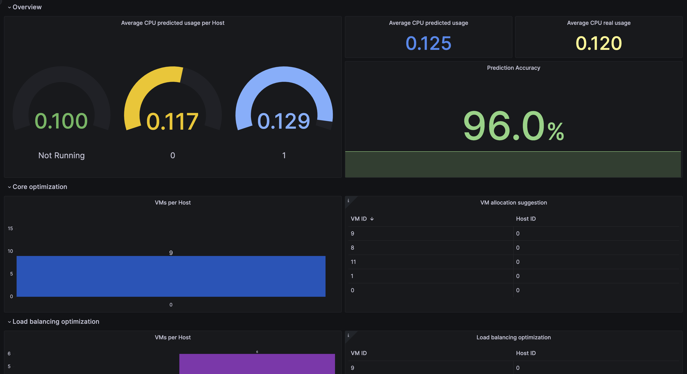

# One-AI Ops - Software Prototype

One-AI Ops interacts with OpenNebula in order to provoid intelligent workload forecasting to optimize the provisioning and deployment of geographically distributed edge/cloud infrastructures and applications.

## Requirements

### OpenNebula Front-end

- OpenNebula 6.6.0 EE or newer.
- Working OpenNebula XMLRPC API interface with oneadmin account authorized to OpenNebula's core with `UID=0`.
- [OpenNebula Prometheus packages](https://docs.opennebula.io/6.6/management_and_operations/monitor_alert/install.html) installed and configured. As is indicated in the linked guide, you can also use your own Prometheus server, but you will need to configure the addon to use it.
- Python3 and `pip3` package installed.

### OpenNebula Node

- [OpenNebula Prometheus-KVM exporter packages](https://docs.opennebula.io/6.6/management_and_operations/monitor_alert/install.html#step-3-install-hosts-packages-hosts) installed and configured.

### Optional (Recommended)

- One-AI Ops generates an output through a custom exporter. In order to visualize this information, we recommend use [Grafana](https://grafana.com/grafana/download) 9.0.0 or newer as visualization tool. You can find a suggested dashboard in the `dashboard` folder of this repository.

## Installation

In order to install One-AI Ops, you need to follow the next steps:

1. Clone the repository: `git clone https://github.com/OpenNebula/one-AIOps.git` in the host where you want to install the addon. This host must have access to both the OpenNebula front-end and the Prometheus server.
2. In the root of the repository, run the following pip3 command to install dependencies: `pip3 install -r requirements.txt`.

## Usage

### Start One-AI Ops

In order to start using One-AI Ops, execute the following command in the root of the repository:

```bash
/bin/bash run.sh
```

This will start the addon and will start to collect data from the OpenNebula front-end and the Prometheus server. The addon will generate a `oneai-%m-%d-%Y.log` file in the logs folder of the repository with the collected data.

### Configuring One-AI Ops

The behaviour of One-AI Ops tool can be configured through the `config.json` file. This file is located in the root of the repository and contains the following parameters:

| Name                | Type   | Description |
|---------------------|--------|-------------|
| exporter_port       | int    | Port used by OneAI to export the results to Prometheus. |
| history_time_range  | int    | Range of days of the history used to calculate the predictions. Note that the higher the range, the longer it may take to compute a prediction (30 days by default).|
| one_xmlrpc_endpoint | string | OpenNebula XML-RPC API endpoint to gather information. |
| one_xmlrpc_user     | string | OpenNebula user name used in XML-RPC API connections. This user should have `USE` permissions over all the infrastructure. No `MANAGE`or `ADMIN` permissions are needed. |
| one_xmlrpc_pwd      | string | OpenNebula user password used in XML-RPC API connections. This user should have `USE` permissions over all the infrastructure. No `MANAGE`or `ADMIN` permissions are needed. |
| prom_endpoint       | string | Prometheus server endpoint to gather and expose metrics. |

OneAI uses a set of optimization functions to produce different types of predictions. The following optimization functions are available:

- Total Cores: Optimize number of cores in use within each cluster.
- Max Load: Optimize load balance within each cluster.
- Distance: Optimize allocation distance (migrations) within each cluster.

Each function contains a number of parameters that can also be configured from the `config.json` file:

| Name                | Type   | Description |
|---------------------|--------|-------------|
| alpha_value         | int    | Host CPU usage threshold (The CPU usage sould no exceed alpha x 100%). |
| core_limit          | int    | Core limt used in the model. |
| distance_limit      | int    | Distance limit used in the model. |
| max_seconds         | int    | Time limit to complete the optimizations. |

### Visualizing One-AI Ops results in Grafana

You can use the `dashboard/oneai-dashboard.json` file to import a pre-configured dashboard in Grafana. This dashboard contains a general information about the infrastructure and the predictions generated by One-AI Ops. It also contains the results of each optimization function and the predictions generated by each one.

In order to use this dashboard, you need to configure the Prometheus data source in Grafana and import the dashboard from the JSON file.

As a result, you will be able to visualize a dashboard similar to the following one:



## Limitations

- One-AI Ops is not able to predict the workload of VMs that are not running at the moment of the prediction. This means that the predictions will not be accurate if the VMs are not running at the moment of the prediction.
- One-AI are not able to interact with the OpenNebula front-end in order to perform the optimizations. This means that the user needs to perform the optimizations manually using the information provided by One-AI Ops.

## License

This project is licensed under the [Apache License](https://www.apache.org/licenses/LICENSE-2.0).

## Acknowledgements

This software prototype has been funded by the Centre for the Development of Industrial Technology (Project OneSmartCosts – CDTI IDI-20221005) and co-financed by the European Union through the European Regional Development Fund (ERDF).
